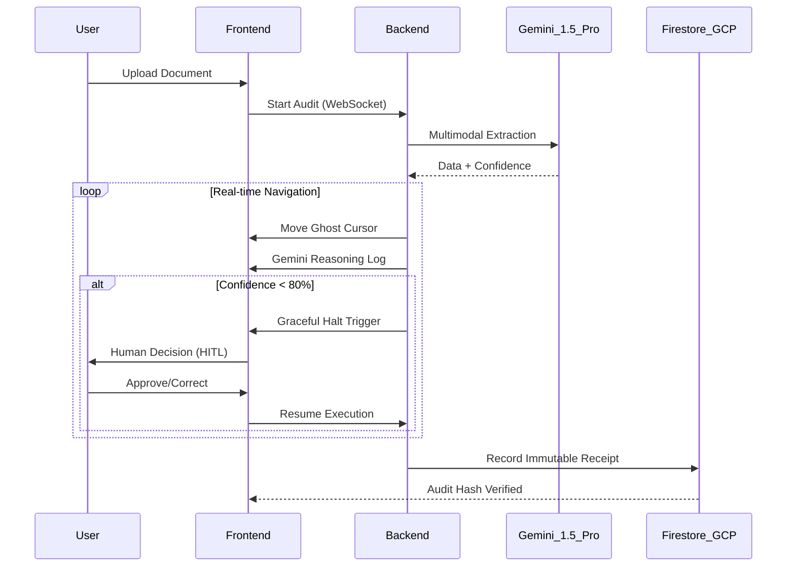

# ComplyAct: Gemini-Powered Agentic Governance for Enterprise APA 🛡️✦

%20(1).png)

[](https://ai.google.dev/)
[](https://cloud.google.com/)
[](https://nextjs.org/)
[](https://fastapi.tiangolo.com/)
[](https://geminiliveagentchallenge.devpost.com/)

---

### 📽️ Experience the Gemini Multimodal Demo
[](https://www.youtube.com/watch?v=xf2LqZiGfic)
*ComplyAct uses Gemini 1.5 Pro to navigate legacy interfaces with real-time multimodal reasoning.*

---

## 🏔️ The Core Vision
Enterprise automation is currently stuck in a dangerous rift. Traditional RPA is too rigid, while modern AI agents are often "black boxes" that hallucinate at scale. **ComplyAct** is the auditable bridge. 

Submitting to the **Gemini Live Agent Challenge (UI Navigator Track)**, ComplyAct demonstrates how **Gemini 1.5 Pro** can interpret unstructured real-world documents and safely navigate legacy ERP systems, governed by a deterministic **Graceful Halt** engine and backed by an immutable record on **Google Cloud Firestore**.

## 🗺️ System Architecture & Workflow Map
%20(1).png)

### 🌟 Key Innovations for the Gemini Challenge

- **Gemini Multimodal Intelligence**: Powered by **Gemini 1.5 Pro**, ComplyAct extracts structured data from complex handwritten invoices and legal documents with precise confidence scoring and visual reasoning.
- **Gemini UI Navigator (Ghost Cursor)**: A visual agent that dynamically navigates legacy ERP systems, interpreting visual input and coordinate-based intent through the lens of Gemini's reasoning.
- **Hyper-Sync Engine**: A real-time synchronization layer that couples Gemini's high-speed reasoning with UI actions, providing a zero-latency interactive experience.
- **Auditable Ledger (Firestore)**: Every software action is transformed into an immutable record. Process traces and cryptographic receipts are persisted to **Google Cloud Firestore**, fulfilling mandatory cloud audit requirements.

---

## 🚥 The Governance-First Workflow
%20(1).png)

1. **Gemini Ingest**: Complex documents (handwritten or digital) are analyzed by Gemini 1.5 Pro.
2. **AI Navigation**: The Gemini UI Navigator begins executing the process on the legacy system.
3. **Graceful Halt (HITL)**: If Gemini's confidence drops below 80% (e.g., due to extreme ambiguity), the engine halts and requests human intervention via a real-time modal.
4. **Cloud Receipt**: Once complete, a SHA-256 cryptographic receipt is generated and stored in Firestore for a permanent audit trail.

---

## 🏗️ Technical Architecture

### Interaction Sequence


---

## 🚀 Deployment & Setup
Designed for the Gemini Challenge, ComplyAct supports rapid deployment.

### 1. Prerequisites
- **Node.js 20+**
- **Python 3.11+**
- **Google Cloud Project** with Firestore enabled.

### 2. Environment Configuration
Create a `.env` in the `backend/` directory:
```env
GOOGLE_API_KEY=your_key
GOOGLE_CLOUD_PROJECT=your_project_id
AI_PROVIDER=GEMINI
```

### 3. Launch
```powershell
.\run_demo.bat
```
Visit [**http://localhost:3000**](http://localhost:3000) to see Gemini in action.

---

## ❤️ Vision
ComplyAct was built to prove that Agentic AI doesn't have to be "scary" for the enterprise. By utilizing Gemini's multimodal power within a strict governance framework, we can build agents that are as accountable as they are capable.

**"Auditable. Accountable. Gemini-Native."**