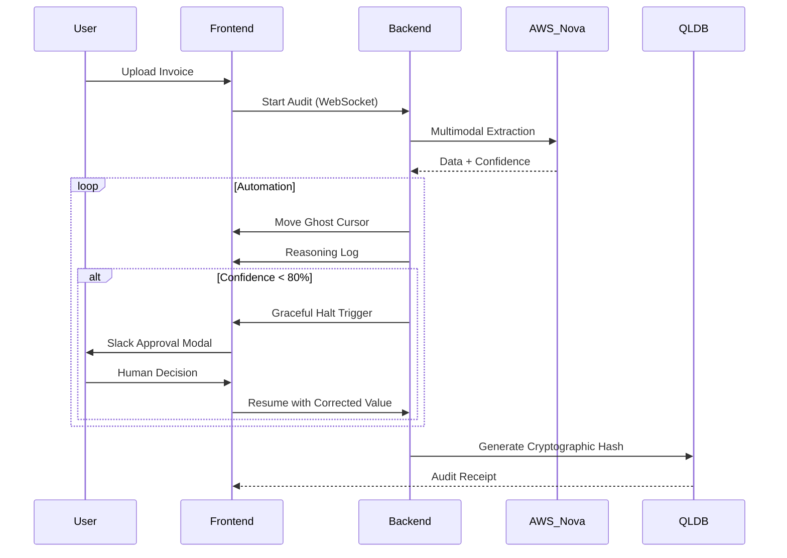

# ComplyAct: Bridging the Hallucination Gap in Enterprise APA 🛡️🤖

%20(1).png)

[](https://nextjs.org/)
[](https://fastapi.tiangolo.com/)
[](https://aws.amazon.com/bedrock/nova/)
[](LICENSE)
[](https://github.com/)

## 📽️ Experience the 90-Second Demo
[](https://www.youtube.com/watch?v=xf2LqZiGfic)
*Click the image above to watch the official ComplyAct demo video.*

---

## 🏔️ The Core Vision
Enterprise automation is currently stuck in a dangerous rift. Traditional RPA is too rigid, while modern AI agents are often "black boxes" that hallucinate at scale. **ComplyAct** is the auditable bridge. We've built a translation layer that safely connects unstructured real-world data to rigid legacy ERP systems, governed by a deterministic **Graceful Halt** engine.

## 🗺️ System Architecture & Workflow Map
%20(1).png)

### 🌟 Key Innovations

- **Multimodal Document Intelligence**: Powered by **Amazon Nova Pro**, ComplyAct extracts structured data from complex handwritten invoices and legal documents with precise confidence scoring.
- **Ghost Cursor (Nova Act Simulation)**: A visual SVG agent that dynamically navigates legacy ERP systems, simulating the **Amazon Nova Act** reasoning model using coordinate-based intent.
- **Hyper-Sync Engine**: A zero-latency synchronization layer that couples agent reasoning with UI actions at 2x speed for a responsive, human-in-the-loop experience.
- **Auditable Ledger (QLDB)**: Every software action is transformed into a permanent legal record, generating a SHA-256 cryptographic receipt verified by **Amazon QLDB**.

---

## 🚥 The Governance-First Workflow
%20(1).png)

1. **Smart Ingest**: Complex documents are ingested via Nova Pro.
2. **AI Automation**: The Ghost Cursor begins navigating the legacy ERP.
3. **Human Oversight**: The engine halts automatically if confidence drops below 80%.
4. **Final Receipt**: A tamper-proof cryptographic receipt is generated for the audit trail.

---

## 🏗️ Technical Deep Dive

### Interaction Sequence


---

## 🚀 One-Click Launch
We have designed ComplyAct for instantaneous local execution. Ensure you have **Node.js 20+** and **Python 3.11+** installed.

### Run the Orchestrator
```powershell
.\run_demo.bat
```
*This script automatically manages port conflicts for both the FastAPI backend and Next.js frontend.*

Visit [**http://localhost:3000**](http://localhost:3000) to begin the audit.

---

## ❤️ Vision & Acknowledgments
ComplyAct was built with a deep respect for the challenges of highly regulated industries. By prioritizing governance over blind speed, we believe we can unlock the true potential of Agentic Process Automation.

Special thanks to the **AWS Bedrock** team for the Amazon Nova stack, providing the high-speed reasoning and interaction models that power this platform.

**"Auditable. Accountable. Agentic Agentic."**